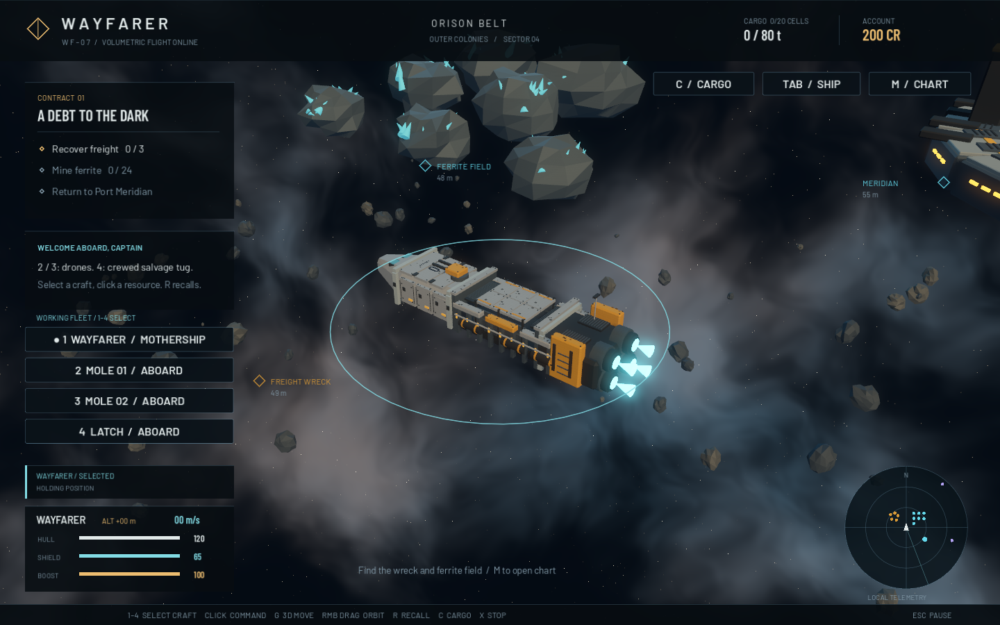
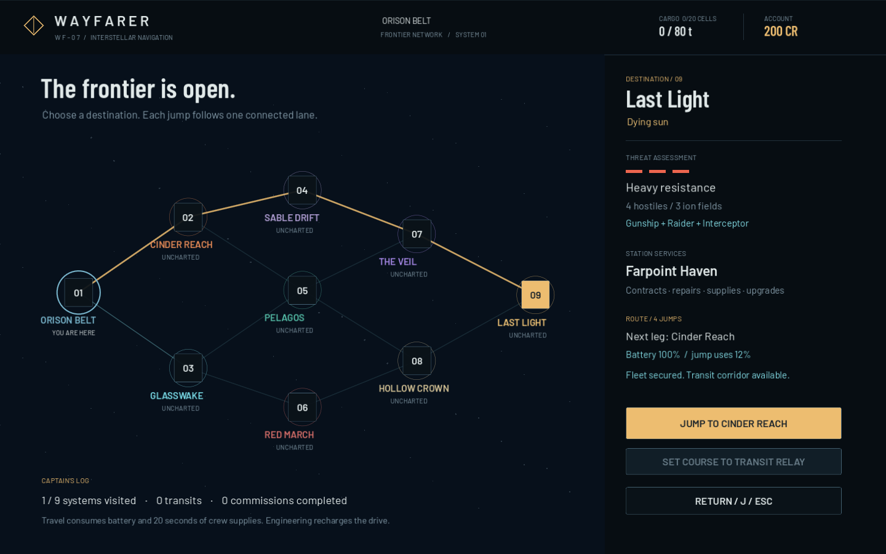
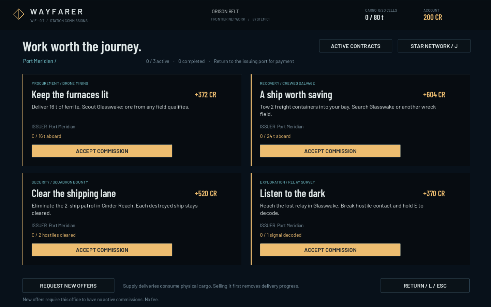
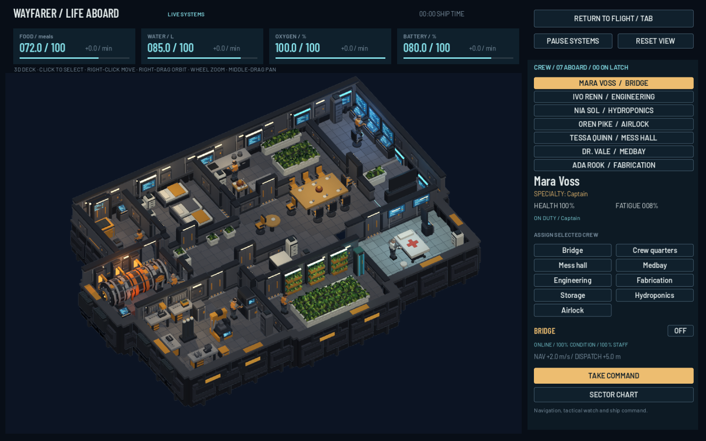

# WAYFARER

**An old ship. A working crew. One last way home.**

A Godot space expedition across nine connected systems. Command an industrial mothership in three dimensions, accept station commissions, send mining drones into asteroid fields, recover freight with a crewed tug, fight generated patrols, survey lost relays, and keep a working crew alive. Physical cargo, depleted resources, destroyed enemies, contracts and explored systems persist between visits.



## Play

Open `builds/Wayfarer.app`, or double-click `Launch Wayfarer.command`. `builds/Wayfarer-macOS.zip` contains the same standalone app; `builds/Wayfarer-source.zip` contains the editable project. The engine and compiled PCK are included, so no editor installation or network connection is required to play.

The native bundle uses the installed **Godot 4.7 stable** universal engine, locally ad-hoc signed. Apple Silicon/M4 Pro is tested; Intel hardware is not. It is not Apple notarized. The editor-capable runtime makes this local bundle larger than an optimized native export template; it launches the game directly. Import `project.godot` in Godot 4.7 to edit it.

## Command the fleet

| Input | Action |
| --- | --- |
| 1 or click Wayfarer | Select the mothership |
| 2 / 3 | Select and launch Mole 01 / Mole 02 mining drones |
| 4 | Select and launch Latch, the two-person salvage tug |
| Fleet buttons | Same selection/launch commands as 1–4 |
| Left drag | Box-select deployed friendly craft; an empty box clears selection |
| Shift + left drag / click a craft | Add to the current selection |
| Left / quick right click space | Move selected craft at the selection’s average altitude, with separate arrival berths |
| Selected drone → click ore | Cut one pod, return and unload, then repeat |
| Selected tug → click freight or core | Crew secures the load, tows it home and unloads |
| Selected Wayfarer → click resource | Approach the contact; press E nearby to dispatch a suitable available craft |
| Selected Wayfarer → click raider | Pursue and fire automatically |
| G | Preview a three-dimensional move order |
| Shift + pointer motion / wheel while plotting | Set destination altitude; Shift locks the horizontal footprint |
| Left click while plotting | Confirm the complete 3D course |
| Right click / Escape while plotting | Discard the draft, preserving the previous order |
| Right or middle drag | Orbit the perspective camera |
| F | Restore default camera angle and zoom |
| R | Recall selected worker; with Wayfarer selected, stop the ship and recall all workers |
| X | Stop all selected craft; a worker retains its carried pod or attached tow |
| Shift | Boost the selected mothership along its route |
| Hold E near station / beacon | Dock / open the corridor |
| C | Inspect the physical cargo bay and reservations |
| Tab | Interactive interior, individual crew and life support |
| M / Space | Local chart (click a contact to plot a course) / survey pulse |
| J | Star network: choose a destination and jump one connected lane |
| L | Station commission board while docked; active contract log in flight |
| Escape | Pause or return to flight |

There is no direct WASD flight. Selection and orders are independent for each craft: changing selection does not cancel another craft's work. Drones and tug accept ordinary move orders and the same G/Shift 3D plotting controls as the mothership. A manual move interrupts their work cycle; R brings any retained load home. Camera follow tracks the selected craft or group center. Box selection uses visible, on-screen friendly craft centers and does not launch workers still aboard. Selection preserves active orders. Shift-drag adds craft; number keys or an ordinary craft click return to single selection. G applies a shared 3D destination to the group, with spaced arrival berths. Resource clicks dispatch compatible selected workers; other craft keep their orders. Escape or right-click cancels a pending selection box without issuing a course. Mining drones and the salvage tug are work vessels, without weapons or a separate combat-loss economy.

Keep the Wayfarer still during the final transfer. Docking automatically recalls deployed craft and waits until they and their loads are aboard. Continue holding E to finish docking after recovery. Opening management screens freezes exterior craft and preserves work progress. Life support continues while the interior is open; PAUSE SYSTEMS freezes its simulation. Chart, cargo, settings and the full pause screen freeze both. An unfinished move preview is discarded.

## Work and physical cargo

The two Moles each carry **one ore pod of up to 4 t**. Cutting removes ore from the rock, but ore and contract progress are credited only when the drone unloads at the Wayfarer. A drone repeats its assigned deposit until stopped, recalled, depleted, or unable to reserve bay space.

Latch carries **Mara Voss (pilot)** and **Ivo Renn (rigger)**. Two crew leave the mothership when it launches and return when it berths. The crew secures a container before towing it. The actual world container follows behind the tug on a visible cable, with reduced towing speed, and moves into the airlock during transfer. Stopping leaves it attached. This is a kinematic tow with a following load, not a rigid-body rope simulation or a wreck-cutting simulation.

The hold has **4 columns × 5 rows per rack deck**. Its fixed geometry, cargo manifest and UI occupancy use the same dimensions:

| Load | Footprint | Mass |
| --- | --- | --- |
| Ore pod | 1×1 cell | 1–4 t |
| Sealed freight | 2×2 cells | 12 t |
| Memory core | 2×1 cells | 8 t |

A load needs both a contiguous footprint and spare structural mass capacity. Four freight containers occupy 16 cells, but the remaining single row cannot fit a fifth 2×2 container even at only 48/80 t. Work orders reserve slots before departure, so simultaneous incoming craft cannot overbook the hold. The C view distinguishes stored cargo from reserved inbound space. The same container model and dimensions appear outside the ship, on the drone, and inside the hold; inspection views magnify the whole scene.

Cargo upgrades install a second/third rack deck inside the existing hold, raising mass limits from **80 → 120 → 180 t**. Cargo never disappears on capacity failure. Sell or complete a supply commission at a station to empty ore/freight cells; the mission core remains aboard. The first contract fits the base hold: three freight containers plus six ore pods use 18/20 cells and 60/80 t.

## The frontier network

Press **J** for nine connected systems, route previews, station names and threat assessments. You can begin travelling immediately; the Meridian story is optional. Select any destination to highlight a shortest route, then use **JUMP TO** for the next leg. A jump requires the drones and tug aboard, no pursuing hostiles, and a nearby station or transit relay. It consumes 10–16% battery and advances life support by 20 seconds. Engineering replenishes battery; docking services restore it. Jumping preserves hull damage, cargo, crew and orders inside the ship. Arrival creates a checkpoint in the destination's safe approach area.

Every frontier system contains a station, a salvage wreck, eight mineable asteroids, a lost survey relay, a transit relay and generated threats. Low-risk patrols contain two interceptors; deeper systems can mix circling raiders and slower, tougher gunships, reaching four hostiles. One to three ion-shear volumes cycle through quiet, a visible three-second warning, then four seconds of discharge. The mothership and hostile ships take damage inside; climbing above or diving below the marked ±9 m volume avoids it. Work craft retain their existing noncombat role.

At a station, open **STATION COMMISSIONS / L**. Pick up to three jobs across any offices:

| Commission | Completion and payment |
| --- | --- |
| Procurement | Deliver 12–20 t of real ore pods at the issuing port. Any source qualifies. |
| Recovery | Use Latch to recover one or two 12 t freight containers and deliver them at the issuer. |
| Patrol bounty | Clear the specified generated squadron, then return for the contract reward in addition to per-kill bounties. |
| Relay survey | Reach the named system's lost relay, break hostile contact and hold E for four seconds. Return with the decoded data. |

Track a job in **L** to guide the flight HUD and star chart. Supply turn-ins consume actual cargo and free its cells: **selling the cargo first removes that delivery progress**. Abandoning a job frees a slot without taking credits or cargo. Stations offer a new rotation when none of that office's commissions is active. Already resolved patrols/signals and insufficient remaining supply are not eligible for new jobs.

The galaxy is a finite expedition with eight frontier systems plus the authored home belt, not an infinite generator. A new expedition creates a new seed. During a voyage, station layouts, asteroid geometry, partial mining, salvage collection and kills stay stable; reloading does not reroll threats or replenish the world. See [FRONTIER.md](docs/FRONTIER.md) for rules and architecture.




## The Meridian story

1. **A debt to the dark:** have Latch deliver 3 freight containers, have drones deliver 24 t of ferrite, then turn in at Meridian.
2. **The silent choir:** destroy the 3 raiders and return to Meridian.
3. **A home between stars:** use Latch to recover the Asterion core, recover all craft, then hold E at the Janus beacon.

Docking repairs and recharges for free. Ore sells for 8 CR/t, freight for 12 CR/t. Optional two-tier engine, weapon, shield and cargo upgrades cost 240/520 CR. Selling cargo preserves cumulative progress for the three authored story acts; station supply commissions require the cargo still aboard at delivery. Individual station staffing affects shield recovery (engineering), weapons (security), speed and nearby job dispatch range (bridge). There is no consumable fuel.

## Life aboard

Press **Tab** for the modeled interior. Select a crew member directly in the 3D world or in the roster, then choose a station under **Assign selected crew**. Crew walk through connected doorways around physical furniture; travel time follows route length. Reassign them while walking to change their destination. Right-click clear floor to give a direct movement order; this removes their job contribution until you assign them back to a station.

**Right-drag orbits, wheel zooms, middle-drag pans, RESET VIEW restores the reference angle.** Click a room or its equipment to inspect the room's controls. PAUSE SYSTEMS freezes resource consumption and crew animation while leaving camera inspection available.

All nine rooms are real, orbitable 3D geometry: structural hull, tiled floors, partitions, sliding pressure doors, bunks, tables and chairs, consoles, reactor, workshop machinery, storage, planting beds and medical fittings. Seven individually modeled jointed crew have walking, typing, repair, cooking, gardening, medical, guard, idle and seated-rest animation clips. The reference is used as a spatial/art guide; it is **not drawn as the game environment**, and no sprite represents a crew member. This is a stylized modeled reconstruction; exact reference fidelity and AAA production quality are not claimed.



[Watch actual movement, doors and camera orbit](docs/screenshots/interior-3d-motion.mp4). [Room and model manifest](docs/INTERIOR_3D.md) documents the placement and implementation.

| Section | Equipment and gameplay |
| --- | --- |
| Bridge | Cyan consoles, navigation watch; Captain improves cruising speed and dispatch reach; command and chart controls |
| Crew quarters | Bunks and lockers; rest reduces fatigue and slowly heals fed, hydrated crew |
| Mess hall | Galley and dining tables; Mess hall lead cooks crops and water into meals; ration policies trade consumption against fatigue |
| Medbay | Medical bed, red cross, monitors; Medical Officer uses medicine to heal crew, with faster care for patients assigned here; emergency first aid works during blackouts |
| Engineering | Reactor, pipes, oxygen scrubber and water recycler; Engineer improves power and shield recovery and maintains station condition; reactor modes, filters and repair kits |
| Fabrication | Workbenches and industrial machines; Fabricator runs a five-order timed queue for medicine, filters and repair kits |
| Storage | Supply lockers and central cargo area; inspect the real 3D hold, process 4 t ore into 4 parts, buy dock supplies; assigned quartermaster reduces waste |
| Hydroponics | Large grow bed and wall crops; Botanist uses water and power to produce crops and oxygen |
| Airlock | Pressure hatch and suit checks; Security protects crew during impacts and improves weapons; launch/recall Latch and maintain seals |

Mara Voss is the Captain, Ivo Renn the Engineer, Nia Sol the Botanist, Oren Pike Security, Tessa Quinn the Mess hall lead, Dr. Vale the Medical Officer and Ada Rook the Fabricator. Any healthy crew member can work another role at 60% training efficiency. Health and fatigue further affect output. Two crew can be assigned to a work station; quarters have three physical bed berths. Mara and Ivo leave their stations while Latch is deployed and return through the airlock.

Manage **meals, water, oxygen and battery**, plus crops, medicine, parts, kits and filters. The top cards show reserves and net rates. Flight also shows vital supplies and shortage warnings. Stations consume power; a depleted battery triggers priority load shedding. Crops feed the galley; recycling and filtration support life support. Shortages injure crew; incapacitated people need rest or care. Station wear, reactor overdrive and combat damage create maintenance needs.

Orders reserve input materials and output locker capacity. Canceling refunds materials once, provided the parts locker has room. Output stops without power or an operator. Ore processing removes actual pods from the cargo manifest; it preserves delivered contract progress and inbound reservations. Supply lockers are separate, capped ship fittings; trade freight and ore retain their physical cargo-bay footprints.

At Meridian, free ship servicing restarts the reactor, restores battery/oxygen, stabilizes injured crew and ensures a usable filter. Paid resupply replenishes meals, water, parts and medicine without overbooking queued output. Returning to the dock from the interior checkpoints assignments, resources and production.

The exterior retains the long axial hull, tapered bridge, grey armor, ochre collars, exposed machinery, four aft engines and sliding cargo hatches. [3D model manifest](docs/INTERIOR_3D.md) records the rebuilt interior and its reference mapping.

## Checkpoints

Docking, station transactions, contract turn-ins, completed inter-system jumps and victory save. **In-flight progress is not saved on quit.** All work craft must be recovered before a checkpoint can be written; transient jobs, pods in transit, tow state and reservations are not serialized. Death/retry restores the last dock or jump-arrival checkpoint, including cargo and resource depletion as of that checkpoint.

Version 5 saves add explored/current systems, seeded generation, station contracts and checkpoint ship condition. Older versions migrate to the home network. Version 4 introduced individual crew, duties, world positions, movement routes, remaining travel, health, fatigue, supplies, station condition, power switches and fabrication alongside the exact cargo layout. Version 3 saves migrate excessive dormitory assignments to available duties to respect the three physical beds, preserving crew health and supplies. Saves validate bounds, identities, capacity and pending output. Version 1/2 saves gain a coherent starting interior while preserving their cargo; version 1 numeric cargo migrates into slots. If necessary, a legacy save receives enough rack decks to preserve its existing legal load. Saves normally live at `~/Library/Application Support/Godot/app_userdata/Wayfarer/expedition.json`; tests and captures use separate files.

## Domain, decisions and source

- [Domain and invariants](docs/DOMAIN.md)
- [Architecture decisions](docs/DECISIONS.md)
- [Validation evidence](docs/VALIDATION.md)
- [Adversarial review](docs/CRITIC_REVIEW.md)

`Expedition` composes `CargoBay`, `InteriorState`, `StarNetwork` and `StationContracts`; `CrewMember` owns individual identity and duty state. These classes own persistent rules. `Ship → CommandShip → PlayerShip/SupportCraft` shares orders and steering; `SupportCraft → MiningDrone/SalvageTug` specializes work and payload handling. `FleetOperations` coordinates the three workers. Navigation, picking, camera, preview, audio and saves are composed systems. `InteriorLayout` defines a meter-space floor plan; `InteriorModel3D` assembles reusable `InteriorProps`; `InteriorNavigation` routes around their footprints; `CrewActor3D` renders joint animations; `InteriorDeck` owns the camera, ray picking and commands; `InteriorUI` presents live state and invokes domain commands. Cargo/ship models remain presentation.

```sh
GODOT=/Applications/Godot.app/Contents/MacOS/Godot
"$GODOT" --headless --path . --editor --import --quit
"$GODOT" --headless --path . --script res://tests/test_suite.gd
"$GODOT" --headless --path . --script res://tests/interior_suite.gd
"$GODOT" --headless --path . --script res://tests/interior_3d_suite.gd
"$GODOT" --headless --path . --script res://tests/playthrough.gd
"$GODOT" --headless --path . --script res://tests/frontier_suite.gd
"$GODOT" --headless --path . --script res://tests/frontier_playthrough.gd
tools/build_macos.sh
```

The pilot flies real routes, dispatches workers, waits for physical return/delivery, trades and upgrades, fights with actual projectiles, and reaches the ending. It does not teleport, grant resources or bypass progression. Capture modes can stage inspection scenes: `ship_detail`, `interior`, `cargo`, `mining_operations`, `tow_operations`, `flight`, `spatial`, `climb`, `manual`, `map`, `dock`, `combat`, `menu` and `won`.

Geometry, joint animations, shaders and audio are authored/generated for this project. The rejected illustrated prototype is archived under `docs/reference/rejected-illustrated` and excluded from the game bundle. Font and engine notices are in [THIRD_PARTY.md](THIRD_PARTY.md). This remains a finished small expedition; the adversarial review does not endorse AAA quality, broad platform certification, or parity with Homeworld's feature set.
